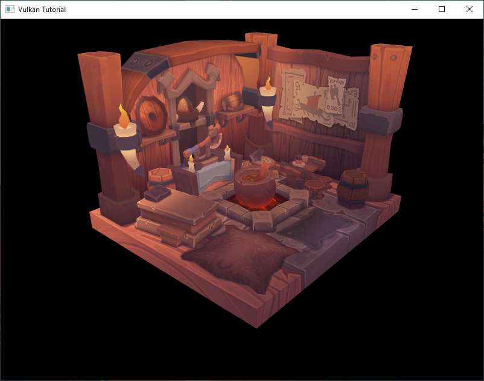

Vulkan Tutorial
==================

Trying to learn some Vulkan by following along with vulkan-tutorial.com

*Latest screenshot:*



### Building


- (optional) Fetch dependencies with:
```
git submodule update --init
```
- (optional) Build and install all deps (see deps/README.md)

- From this directory, configure and build using a provided preset:
```
cmake --preset default
cmake --build preset debug
```


### Dependencies

These should be installed using instructions in deps/README.md, or globally installed:
- VulkanSDK @ 1.3.236.0
- sdl2 @ 2.28.0
- SDL2_image[core,libjpeg-turbo] @ 2.6.3
- glm @ 0.9.9.8
- tinyobjloader @ 2.0.0-rc10

Exact versions may not matter, but this is what I'm using.
