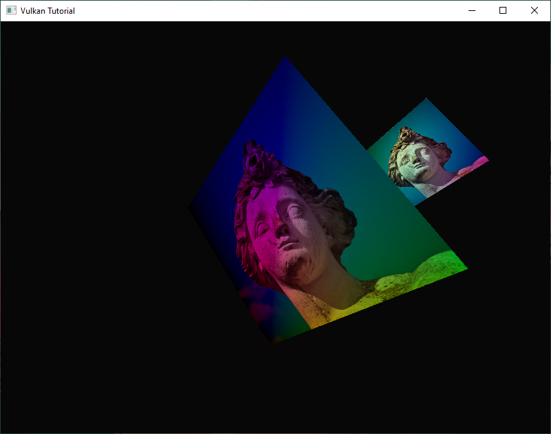

Vulkan Tutorial
==================

Trying to learn some Vulkan by following along with vulkan-tutorial.com

*Latest screenshot:*

### Dependencies

These should be globally installed. I'm using vcpkg on Windows and brew on Mac.

- sdl2 @ 2.26.2
- SDL2_image[core,libjpeg-turbo] @ 2.6.2
- glm @ 0.9.9.8
- VulkanSDK @ 1.3.236.0

Exact versions may not matter, but this is what I'm using.
